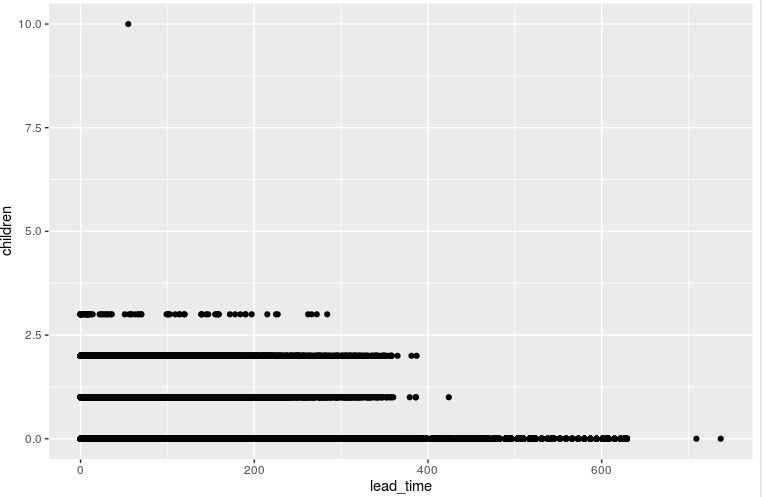
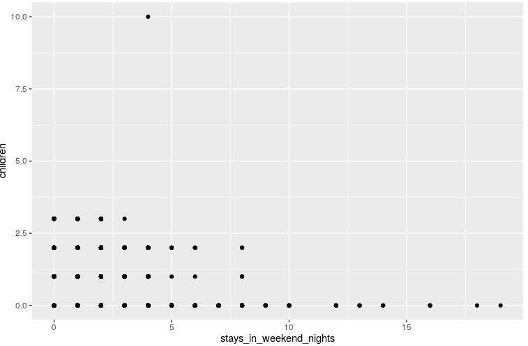

# R_Data_Analysis_Hotel_Bookings
Data cleaning process using the R programming language. Code useable in R studio with relevant comments

# Overview

Purpose of project was to import a hotel dataset, clean and then present visuals.

## Results

# Cleaning process 
*Renamed hotel to hotel_type to be more specific
*Combined month and year into one column with unite
*Created new column that summed all the adults, children, and babies on a reservation for the total number of people

#Analysis
*Found total number of canceled bookings and average lead time for booking
*Found guest(s) with children do not affect hotel booking (Image 1)
*Found guest(s) without children book more weekend nights (Image 2)

# Children do not affect hotel booking timing

# Guests without children book more weekend nights

